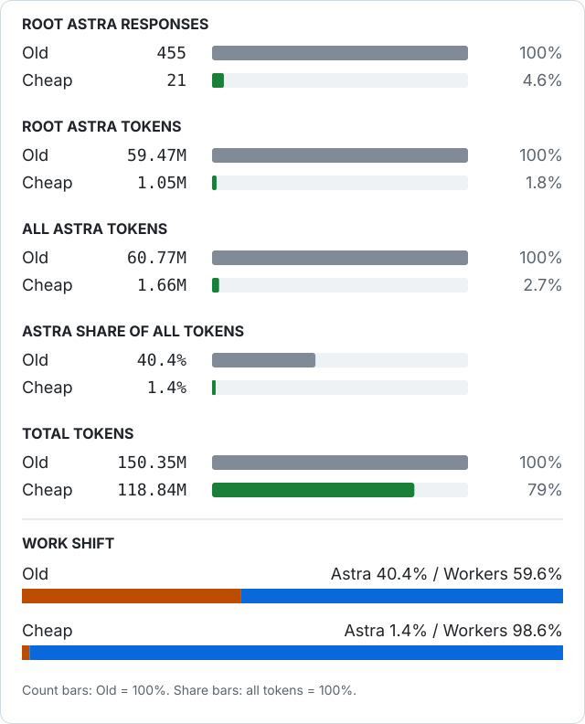

# Flatplanet Orchestrator

Cost-efficient multi-agent orchestration skill for OpenAI Codex.

**Quick navigation:** [Results](#what-you-can-gain) · [Quality](#cost-vs-quality) · [Profiles](#execution-profiles) · [Install](#install-in-a-repository) · [Update](#update-an-existing-installation) · [Usage](#usage) · [Case study](docs/BENCHMARK-CASE-STUDY.md)

The goal is simple:

- keep the expensive root model focused on planning, architecture and final integration,
- delegate long-running execution to cheaper worker models,
- avoid short `wait_agent` polling loops,
- avoid duplicate work between the root and subagents,
- choose the worker model per task with a simple execution profile.


## What you can gain

In a real comparison of the same non-trivial implementation task, the **Old orchestration** was compared with the **Cheap profile** (`GPT-5.6 Luna / max` worker):

**Benchmark plan:** ChatGPT Pro.

| Metric | Old orchestration | Cheap profile | Change |
|---|---:|---:|---:|
| Root Astra responses | 455 | 21 | **-95.4%** |
| Root Astra tokens | 59.47M | 1.05M | **-98.2%** |
| All Astra tokens | 60.77M | 1.66M | **-97.3%** |
| Astra share of all tokens | 40.4% | 1.4% | **-39.0 pp** |
| Total tokens | 150.35M | 118.84M | **-21.0%** |
| Worker tokens | 89.58M | 117.18M | **+30.8%** |
| Visible weekly allowance delta (Pro) | +4 pp | 0 pp visible | see caveats |

The important shift is not merely "fewer tokens." It is **moving execution away from the expensive root model and into the worker model**, while keeping Astra for planning and review.


### At a glance

<p>
  
</p>

The goal is not to eliminate worker compute. The goal is to make **expensive orchestration sparse** and let cheaper workers do the long-running execution.

The Cheap profile run took longer wall-clock time (151m42s vs 106m56s), but the Astra root almost stopped consuming context while the worker was active.

A later independent branch-to-branch quality review found that **Old orchestration was technically stronger by a moderate margin**. The final reviewed branches had **0 High / 5 Medium / 1 Low** findings for Old orchestration versus **1 High / 8 Medium / 2 Low** for the Cheap profile. Neither branch was considered ready to merge without additional fixes.

> These numbers are one measured case study, not a guaranteed savings ratio. On this ChatGPT Pro account, the backend `primary` window represented the 7-day/weekly allowance. The secondary window was unavailable in these captures. Displayed allowance percentages may be rounded or delayed.

See **[Benchmark case study](docs/BENCHMARK-CASE-STUDY.md)** for the complete methodology, raw numbers, quality findings, tests, and limitations.

### Cost vs quality

The benchmark shows a clear trade-off:

```text
USAGE / ORCHESTRATION EFFICIENCY

Old orchestration  ██████████████████████████████████████████████  expensive
Cheap profile      █                                                   much lower Astra usage


IMPLEMENTATION QUALITY (independent review)

Old orchestration  ██████████████████████████████████████          stronger
Cheap profile      ███████████████████████████████                 weaker
```

Independent review summary:

| Finding severity | Old orchestration | Cheap profile |
|---|---:|---:|
| Critical | 0 | 0 |
| High | **0** | **1** |
| Medium | **5** | **8** |
| Low | **1** | **2** |

The Old orchestration branch had stronger coverage around concurrency, delayed responses, autosave behavior, currencies, and editor recovery. The Cheap profile still had a correct transactional core, but missed more product and edge-case behavior.

This is why `cheap` is intentionally **not** the default production profile. Use `balanced` (Terra High) for normal production work and reserve `cheap` for bounded, lower-risk tasks.


## Execution profiles

| Profile | Worker | Reasoning | Typical use |
|---|---|---|---|
| `cheap` | GPT-5.6 Luna | max | small, bounded, routine changes |
| `balanced` | GPT-5.6 Terra | high | default production development |
| `strong` | GPT-5.6 Sol | high | difficult debugging/refactors |
| `max` | GPT-6 Astra | medium | exceptional, high-risk tasks |

Fixed roles by default:

- root: GPT-6 Astra / medium
- explorer: GPT-5.6 Luna / max
- researcher: GPT-5.6 Luna / max
- tester: GPT-5.6 Luna / max
- reviewer: GPT-6 Astra / dynamic effort (`low` for low-risk review, `medium` for high-risk review and final re-review after High/Critical findings)

## Install in a repository

Run these commands in **your application repository**, not in a separate clone of Flatplanet Orchestrator. The examples use Bash, Git, and standard Linux tools. Finish any active Codex task before replacing its skill files.

### First installation

This downloads the current `main` branch and copies only this skill. It refuses to overwrite an existing installation; use the update procedure below instead.

```bash
(
  set -euo pipefail
  cd "$(git rev-parse --show-toplevel)"
  skill=".agents/skills/flatplanet-orchestrator"

  if [ -e "$skill" ] || [ -L "$skill" ]; then
    echo "Already installed. Use the update instructions below." >&2
    exit 1
  fi

  tmpdir="$(mktemp -d)"
  trap 'rm -rf -- "$tmpdir"' EXIT
  git clone --depth 1 --branch main \
    https://github.com/flatplanetpl/flatplanet-orchestrator.git \
    "$tmpdir/source"
  test -f "$tmpdir/source/$skill/SKILL.md"

  mkdir -p .agents/skills
  cp -R -- "$tmpdir/source/$skill" "$skill"
  printf 'Installed from commit: '
  git -C "$tmpdir/source" rev-parse HEAD
)
```

### Update an existing installation

For a skill installed by copying its directory, run this from the application repository whenever you want the current version from `main`.

**Overwrite behavior:** matching files inside `.agents/skills/flatplanet-orchestrator/` are replaced in full, not merged. New upstream files are added; files that exist only locally are retained. A complete backup is made before copying the update. Neither `.codex/config.toml`, `AGENTS.md`, nor other skills are modified.

```bash
(
  set -euo pipefail
  cd "$(git rev-parse --show-toplevel)"
  skill=".agents/skills/flatplanet-orchestrator"

  if [ ! -f "$skill/SKILL.md" ]; then
    echo "Skill not found. Use the first-installation instructions." >&2
    exit 1
  fi
  if [ -L .agents ] || [ -L .agents/skills ] || [ -L "$skill" ] ||
     [ -n "$(find "$skill" -type l -print -quit)" ]; then
    echo "Symlinked installation: update its source directory instead." >&2
    exit 1
  fi

  tmpdir="$(mktemp -d)"
  trap 'rm -rf -- "$tmpdir"' EXIT
  git clone --depth 1 --branch main \
    https://github.com/flatplanetpl/flatplanet-orchestrator.git \
    "$tmpdir/source"
  test -f "$tmpdir/source/$skill/SKILL.md"

  backup_root="${XDG_STATE_HOME:-$HOME/.local/state}/flatplanet-orchestrator/backups"
  mkdir -p -- "$backup_root"
  backup="$(mktemp -d "$backup_root/update.XXXXXXXX")"
  cp -a -- "$skill" "$backup/flatplanet-orchestrator"
  printf 'Backup: %s\n' "$backup/flatplanet-orchestrator"

  cp -R -- "$tmpdir/source/$skill/." "$skill/"
  printf 'Updated from commit: '
  git -C "$tmpdir/source" rev-parse HEAD
)
```

The command prints the backup location and upstream commit SHA. Backups are kept outside the skill-discovery directories, under `${XDG_STATE_HOME:-$HOME/.local/state}/flatplanet-orchestrator/backups/`.

Local edits to upstream-managed files, including `SKILL.md`, must be reapplied or merged manually from the backup. Local-only files are not deleted automatically; review any obsolete helper or reference files when updating.

A `git pull` in a separate Flatplanet Orchestrator clone updates that clone only, not the copy installed in your application repository. The procedure above refreshes the installed copy directly. It does not stage or commit changes in your application repository.

### Verify the installation or update

From the application repository root:

```bash
grep '^name:' .agents/skills/flatplanet-orchestrator/SKILL.md
git status --short -- .agents/skills/flatplanet-orchestrator
git diff -- .agents/skills/flatplanet-orchestrator
```

The name should be `flatplanet-orchestrator`. Review the changes and any newly added files before committing them to your application repository. For a clean verification run, start a new Codex session from that repository root:

```bash
codex
```

## Usage

Default profile (`balanced`):

```text
$flatplanet-orchestrator implement ticket GR-UX-01A
```

Cheap:

```text
$flatplanet-orchestrator profile=cheap fix the form validation
```

Strong:

```text
$flatplanet-orchestrator profile=strong redesign the data synchronization
```

Explicit worker override:

```text
$flatplanet-orchestrator worker=terra effort=high implement the ticket
```

### Blind / adversarial review

Independent reviewers are intentionally **not primed by the worker's success narrative**.

The first review pass follows:

```text
spec / acceptance criteria
          ↓
final implementation
          ↓
test code
          ↓
adversarial review
          ↓
test/build evidence
```

The reviewer is asked to **falsify correctness**: find missing behavior, semantic mistakes, stale-state/concurrency failures, and tests that may simply encode the implementation's bug.

Worker model/profile and worker claims are withheld from the first-pass reviewer when possible to reduce anchoring bias.

After fixes, re-review verifies previous findings **and** performs a fresh regression scan.

### Dynamic reviewer effort

Reviewer cost also scales with risk:

```text
low-risk change                         -> Astra reviewer / low
money, inventory, concurrency,
migrations, security, cross-tenant     -> Astra reviewer / medium
Cheap profile below risk-aware floor   -> Astra reviewer / medium
fix after Critical/High finding        -> final Astra reviewer / medium
```

This keeps routine review inexpensive while using stronger reasoning where the quality benchmark showed it matters.

## Why this exists

A root orchestrator can burn a large amount of usage by repeatedly waking while subagents are still working. This skill therefore enforces:

- explicit long `wait_agent(timeout_ms=...)` calls,
- no heartbeat polling,
- no progress-report chatter from workers,
- no root inspection of partial worker-owned diffs,
- batching correction passes,
- independent testing/review only when it materially improves confidence.

The preferred flow is:

```text
Astra root
  -> plan / decompose
  -> spawn worker(s)
  -> LONG WAIT
  -> integrate completed result
  -> optional tester
  -> optional Astra reviewer
  -> one correction pass
  -> final verification
```

## Benchmarking

When comparing orchestration strategies, track at least:

- root model responses,
- root cached input,
- root total tokens,
- worker total tokens,
- root share of total tokens,
- task wall time,
- Codex primary/secondary allowance delta when available.

A healthy run should move most execution tokens away from the expensive root and into the selected worker model.
