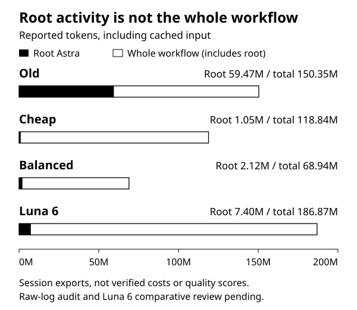

# Flatplanet Orchestrator

Cost-conscious multi-agent orchestration skill for OpenAI Codex.

Keep Astra focused on planning and integration; delegate implementation to workers selected by profile, avoid repeated polling and duplicate work, and apply independent verification according to risk.

**This is a repository-local instruction skill, not a standalone orchestration engine.** The installer copies the skill into your application repository. It does not install Codex, grant model access, or configure the root model.

**Navigation:** [Quick start](#quick-start) · [Requirements](#requirements-and-compatibility) · [Profiles](#execution-profiles) · [Usage](#usage) · [Verification](#how-it-works) · [Update](#update-an-existing-installation) · [Results](#observed-benchmark-results) · [Docs](#documentation-and-roadmap)

<a id="install-in-a-repository"></a>
<a id="first-installation"></a>

## Quick start

For Linux with Bash, Git and GNU coreutils, plus an installed, signed-in Codex client with the required models and subagent tools. Replace `/path/to/application-repo` with an existing Git working tree. Finish any active Codex task before replacing skill files.

Clone the skill source once; skip this step if you already have the clone:

```bash
git clone --depth 1 --branch main \
  https://github.com/flatplanetpl/flatplanet-orchestrator.git \
  ~/flatplanet-orchestrator
```

Install from that checkout, then start Codex with the intended root settings:

```bash
bash ~/flatplanet-orchestrator/scripts/install.sh /path/to/application-repo &&
cd /path/to/application-repo &&
codex -m gpt-6-astra -c 'model_reasoning_effort="medium"'
```

Enter the following **in the Codex prompt, not in Bash**:

```text
$flatplanet-orchestrator profile=balanced add pagination to the orders endpoint and cover it with tests
```

The installation lives at `.agents/skills/flatplanet-orchestrator/SKILL.md`. Existing installations are not overwritten by `install.sh`; use the [updater](#update-an-existing-installation). See [first-run verification and troubleshooting](docs/SETUP.md) before relying on a profile's model settings.

## Requirements and compatibility

Use a client that discovers repository skills and supports subagent spawning with explicit model/effort settings and long waits. Your account must have access to the required root, worker and verification models. **A missing model or tool is a compatibility blocker, not permission to silently substitute the root.**

The [Luna 6 run](benchmark/runs/2026-09-25-GR-UX-01-luna6.md) records **Codex CLI 0.157.0** in a Linux-style `/home/ubuntu/...` environment. That is historical run evidence, not a minimum-version guarantee or certification of the current skill on every client. Native Windows, macOS and WSL installer compatibility is not established by that record; these are Bash/GNU scripts, not PowerShell scripts.

The model IDs below are this skill's configured targets, not a claim that every account or client offers them. [Setup](docs/SETUP.md) covers configuration precedence, effective-setting checks, platform boundaries and links to the official Codex documentation.

## Execution profiles

| Profile | Worker model ID | Effort | Intended use |
|---|---|---|---|
| `cheap` | `gpt-5.6-luna` | `max` | Small, bounded, low-risk changes |
| `luna6` | `gpt-6-luna` | `max` | Explicit GPT-6 Luna selection / benchmarking |
| `balanced` | `gpt-5.6-terra` | `high` | Ordinary production baseline |
| `strong` | `gpt-5.6-sol` | `high` | Complex debugging, refactors, interacting risks |
| `max` | `gpt-6-astra` | `medium` | Exceptional capability needs; not size alone |

**Without a profile or worker override:** start from `balanced` and apply the risk-aware floor. Low-risk, well-bounded work may use `cheap`; ordinary production work and material risk signals require at least `balanced`; multiple interacting risks strongly favor `strong`. `max` is exceptional and `luna6` is explicit-only.

**With an explicit selection:** honor the requested profile. `worker=` overrides its worker model and `effort=` overrides its reasoning effort. An effort-only override does not disable risk-aware model selection. Do not silently upgrade a selected model; a cheaper selection does not weaken verification requirements.

The root remains **GPT-6 Astra / medium** unless explicitly overridden. Explorer, researcher and tester use **GPT-5.6 Luna / max**. The reviewer uses **GPT-6 Astra**, with effort based on review risk. Selecting a worker profile does not reconfigure these other roles or switch an already running root session.

## Usage

Choose a profile explicitly to make the intended implementation model clear:

```text
$flatplanet-orchestrator profile=cheap fix the form validation
$flatplanet-orchestrator profile=luna6 implement the search filters with tests
$flatplanet-orchestrator profile=strong redesign the data synchronization
$flatplanet-orchestrator worker=terra effort=high implement the pagination endpoint
```

Omitting the profile enables the risk-aware selection described above:

```text
$flatplanet-orchestrator implement the search filters with tests
```

These are skill prompt parameters, not Codex CLI flags. Full policies and supported overrides live in [SKILL.md](.agents/skills/flatplanet-orchestrator/SKILL.md).

<a id="why-this-exists"></a>

## How it works

The root derives acceptance criteria, divides ownership, delegates bounded work, and waits for completed results rather than monitoring partial diffs. Small, genuinely local tasks may remain root-only.

```text
Plan and assess risk
  -> delegate implementation and targeted tests
  -> long wait; no duplicate root work
  -> integrate completed results
  -> independent testing when required by risk
  -> independent Astra review when required by risk
  -> batch corrections and regression tests
  -> mandatory re-review after any Critical/High finding
  -> final verification and explicit acceptance status
```

**Independent testing is required** for material risk signals, explicit `cheap` use on non-trivial production work, relevant state/concurrency changes, and substantial corrections. **Independent Astra review is required** for money/currency, data integrity, concurrency/idempotency, production-data migrations, security/tenant boundaries, irreversible transitions, interacting risks, and non-trivial `cheap` work below the risk-aware recommendation. Extra testing or review can also be used when useful; genuinely small, low-risk changes do not require every role.

<a id="blind--adversarial-review"></a>

The first review starts from **requirements → final implementation → test code → adversarial findings → test/build evidence**, not the worker's success narrative. Worker model/profile and claims are withheld to reduce anchoring bias. After fixes, review checks both previous findings and fresh regressions.

<a id="dynamic-reviewer-effort"></a>

Reviewer effort is `low` only where the low-risk conditions in the skill permit it, and `medium` for the listed higher-risk cases. A **final independent Astra / medium re-review is mandatory after Critical/High findings**; root self-review is not a substitute. Passing tests alone never establish complete product acceptance.

## Update an existing installation

Finish active Codex work, refresh the source clone, and copy it into the application:

```bash
git -C ~/flatplanet-orchestrator pull --ff-only &&
bash ~/flatplanet-orchestrator/scripts/update.sh /path/to/application-repo
```

A full backup is created before matching skill files are replaced. Local-only files remain; customizations in replaced files are **not merged**. Neither script modifies `.codex/config.toml`, `AGENTS.md`, other skills, Git staging or commits. A `git pull` alone does not refresh the application's copy.

<a id="verify-the-installation-or-update"></a>

Review modified and newly added files, then start a new Codex session. See [backup, recovery and verification details](docs/SETUP.md). Offline installer tests run from the source checkout with `python3 -m unittest discover -s tests -p 'test_*.py'`.

<a id="what-you-can-gain"></a>

## Observed benchmark results

The GR-UX-01A case study contains four maintainer-supplied implementation runs on **ChatGPT Pro**, in this order: Old → Cheap → Balanced → Luna 6. These are session exports, not a new benchmark execution or a guaranteed savings ratio.

<a id="at-a-glance"></a>



| Run | Root Astra tokens | Whole-workflow tokens |
|---|---:|---:|
| Old | 59.47M | 150.35M |
| Cheap | 1.05M | 118.84M |
| Balanced | 2.12M | 68.94M |
| Luna 6 | 7.40M | 186.87M |

Token totals include cached input; separately reported reasoning must not be added again. Root tokens are a subset of the workflow total, not an additional charge. For example, Luna 6 has **87.6% fewer root tokens but 24.3% more total tokens than Old** in the supplied exports. Different models, tester workloads, review rounds and CLI/skill versions prevent a clean model-only comparison.

> **Measurement limits:** Luna 6's export is **ARITHMETIC CHECKED; RAW LOG AUDIT PENDING**. The helper, duplicate/resumed history and per-event model attribution have not been independently audited. No counting error has been established; reported figures are retained. Session span is not verified active coding time, and shared-account allowance changes are not isolated charges. These figures do not establish monetary savings or a model-speed ranking.

<a id="cost-vs-quality"></a>

### Token usage and implementation quality

The later final-snapshot review found High/Medium/Low issues of **1/4/2 for Old**, **6/5/2 for Cheap**, and **3/3/2 for Balanced**, with zero Critical findings in those three snapshots. It preferred Old as a starting point, but all three had material blockers. **Luna 6 has not received the same comparative review**; its in-process fixes are not a zero-defect result. Luna 6 acceptance remains **PARTIAL**, and its final source-snapshot identity has not been supplied.

**The evidence does not support “same quality at lower cost.”** `balanced` is an operating baseline, not an experimentally established quality winner. The [four-run comparison](docs/BENCHMARK-CASE-STUDY.md), [Luna 6 report](benchmark/runs/2026-09-25-GR-UX-01-luna6.md) and [usage validation gate](benchmark/HARNESS.md#usage-validation-gate) retain the exact counts, timing/allowance caveats and acceptance gaps. The [historical Old/Cheap study](docs/BENCHMARK-CASE-STUDY-OLD-CHEAP.md) and its [original chart](docs/assets/benchmark-at-a-glance.svg) remain unchanged.

<a id="benchmarking"></a>
<a id="todo-and-roadmap"></a>

## Documentation and roadmap

[Setup and troubleshooting](docs/SETUP.md) · [Skill policies](.agents/skills/flatplanet-orchestrator/SKILL.md) · [Benchmark index](benchmark/README.md) · [Harness](benchmark/HARNESS.md) · [Run template](benchmark/RUN-TEMPLATE.md)

The tooling direction is repeatable preflight, snapshot capture, effective-model checks and validated usage exports. These are **proposed improvements, not implemented features or release commitments**. The full [benchmark evidence and tooling backlog](benchmark/TODO.md) preserves the open tasks and completion rules separately from this introduction. Application acceptance gaps remain in the run report; they are not missing orchestrator features.
